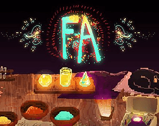
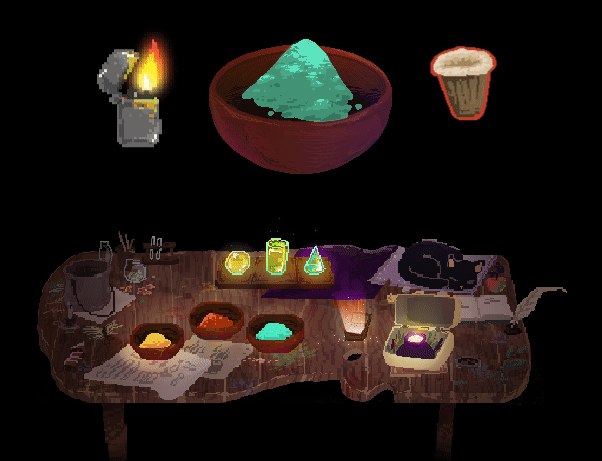

# Firework Alchemyst
Created in **a week** for a workshop around colors. Create with JavaScript, then ported on Haxe with Heaps Engine

In The Firework Alchemist, the player embodies a pyrotechnic artist: at his disposal, pigments, artifacts and glitter, which will allow him to create a firework.

Available on [itch.io](https://nekromana.itch.io/the-firework-alchemist)  
The JavaScript Version is [available here](https://github.com/Bigaston/FireworkAlchemyst/tree/javascript)

